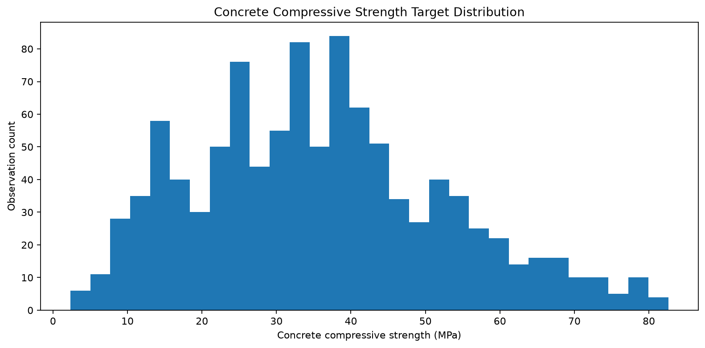
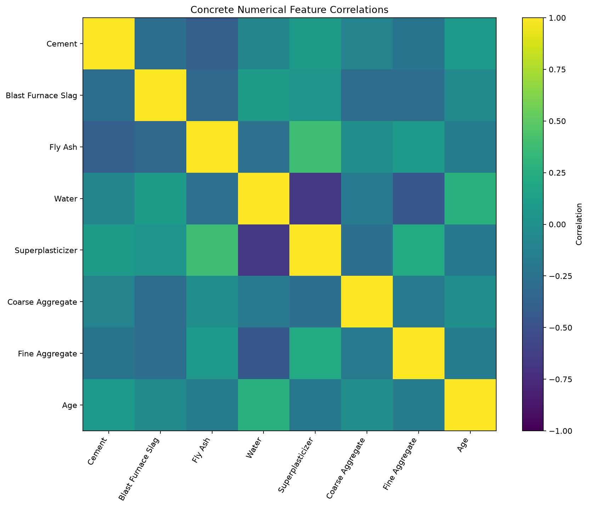
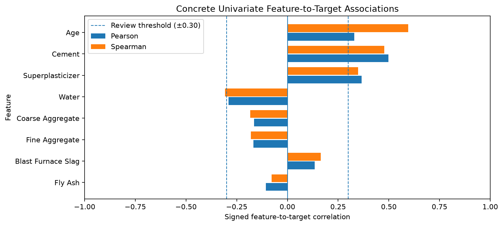
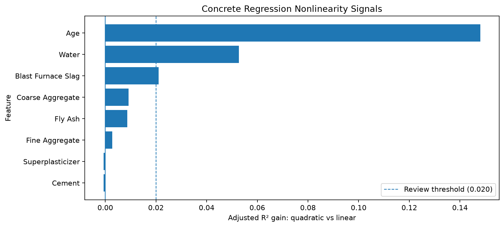
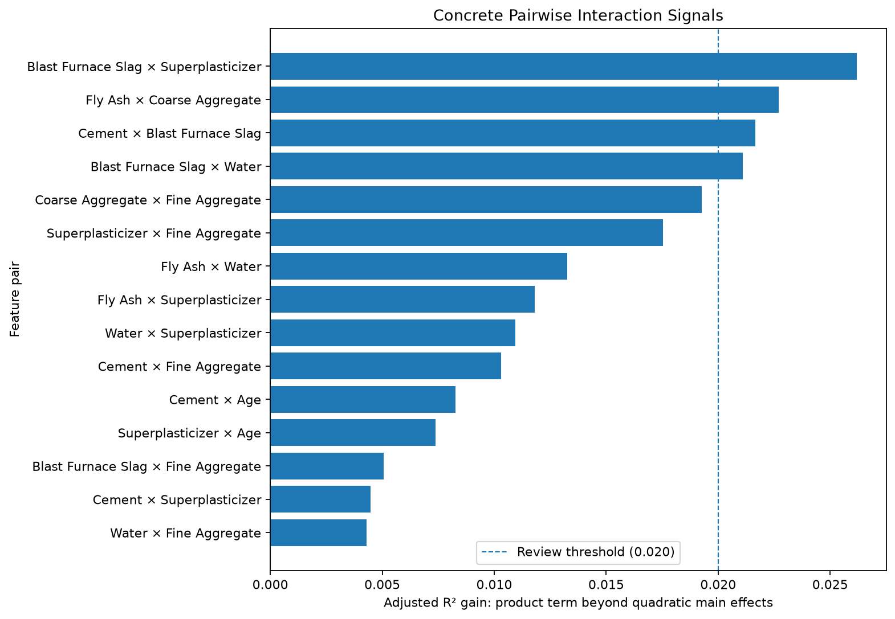

# Concrete Compressive Strength — Reproducible Continuous Regression Study

## Overview

This repository is an educational, reproducible continuous-regression study of
the **Concrete Compressive Strength** dataset from the UCI Machine Learning
Repository (dataset `165`, DOI `10.24432/C5PK67`). The source has 1,030 rows and
9 columns: eight numerical predictors and the continuous target **Concrete
compressive strength**, measured in MPa.

| Item | Value |
|---|---|
| Problem type | `continuous_regression` |
| Rows / columns | 1,030 / 9 |
| Predictors | 8 numerical features (7 mixture components + curing age) |
| Distinct mixtures | 427 (784 rows belong to mixtures measured at several ages) |
| Target | Concrete compressive strength |
| Target unit | MPa |
| Selected model | HistGradientBoostingRegressor |
| Feature policy | `all_features` |
| Evaluation scope | Held-out rows mostly share their mixture with training rows (see [Evaluation scope](#evaluation-scope-repeated-mixtures)) |
| Operational modeling ready | No |
| Operational validity | Unconfirmed |

## Scientific workflow

```text
Pinned UCI source (contracts/source.json)
        ↓
01 — Data Understanding and Exploration
        ↓
02 — Data Preparation
        ↓
03 — Model Selection and Evaluation
        ↓
04 — Final Model + One-Time Test + Bundle
        ↓
05 — Independent Inference Demo
```

Each notebook starts from persisted artifacts rather than live variables from
the preceding notebook. Notebooks 01–04 refuse to run outside the canonical
runtime (`.python-version` + `pylock.toml`). The test partition remains sealed
through model selection and is accessed only by Notebook 04 after the winner
and finalization contract are frozen. Notebook 05 is an independent, read-only
consumer of final artifacts.

## Dataset

Predictors, in contract order:

1. Cement
2. Blast Furnace Slag
3. Fly Ash
4. Water
5. Superplasticizer
6. Coarse Aggregate
7. Fine Aggregate
8. Age

The target is **Concrete compressive strength**, a quantitative continuous
measurement on its original MPa scale.

Source: I-Cheng Yeh, *Modeling of strength of high-performance concrete using
artificial neural networks*, Cement and Concrete Research 28(12), 1998
(doi:10.1016/S0008-8846(98)00165-3), distributed by the UCI Machine Learning
Repository under **CC BY 4.0**. The raw data are not redistributed here; the
expected bytes of the acquired `dataset.csv` are pinned in
[`contracts/source.json`](contracts/source.json) (SHA-256
`2f6e632031e655e2344153e4d84bbebcfc7d53f91cad3ab8130076a8e1d4e1be`), and
Notebooks 01 and 02 verify every acquisition against it.

## Important data-quality findings

The current exploration and preparation evidence confirms:

- all 1,030 rows have a present, finite target;
- UCI metadata declares Blast Furnace Slag as Integer, while the materialized
  source is `float64`; 298 rows (28.932%) have non-integer values, which are
  preserved exactly;
- 11 exact-row-equality groups contain 36 rows;
- 19 repeated feature-profile groups contain 57 rows: 10 groups/33 rows share
  a target, while 9 groups/24 rows have target disagreement;
- the seven mixture components identify only **427 distinct mixtures**; 181 of
  them are measured at more than one curing age and cover 784 rows (largest
  mixture: 20 rows);
- no source observation identifier exists, so equality is not evidence of
  duplicate identity and no rows were removed;
- all eight predictors were retained, with no generic outlier removal,
  clipping, winsorization, target binning, or target transformation; and
- values outside 1.5-IQR fences are descriptive diagnostics, not deletion
  rules.

## Exploratory figures











Every figure in `docs/images/` is exported by Notebook 01 and referenced here;
`tests/test_study_integrity.py` enforces that correspondence.

## Preparation and split

Notebook 02 produces a static educational snapshot using a shuffled,
non-stratified, row-level regression split. Target bins are not used, and no
learned preprocessing is fit during preparation.

| Partition | Rows | Fraction |
|---|---:|---:|
| Train | 721 | 70% |
| Validation | 154 | 15% |
| Test | 155 | 15% |

The split ID is `shuffled-70-15-15-seed-42`; the primary seed is 42 and the
second-stage seed is 43. Technical row membership is integrity evidence, not a
claim of semantic observation identity. The split is not grouped by mixture;
the consequences are stated in [Evaluation scope](#evaluation-scope-repeated-mixtures).
The test artifact stays sealed downstream until Notebook 04.

## Model selection

Notebook 03 compares `DummyRegressor(strategy="median")`, Ridge,
DecisionTreeRegressor, RandomForestRegressor, and
HistGradientBoostingRegressor in two stages:

1. **Hyperparameters per family** — `GridSearchCV` on the 721 training rows
   only, with `KFold(n_splits=5, shuffle=True, random_state=42)` and MAE as the
   refit metric.
2. **Family** — each frozen family winner is fitted once on train and ranked by
   **validation MAE** (lower is better); candidates within the predeclared
   practical tie tolerance of 0.10 MPa fall back to RMSE, MedAE, CV-MAE
   standard deviation, R², and model ID. RMSE, R², and MedAE are secondary.

Validation metrics of the frozen candidates (the evidence used for the family
choice):

| Model | MAE | RMSE | R² | MedAE |
|---|---:|---:|---:|---:|
| Dummy median | 12.8145 | 15.8699 | -0.0005 | 11.2600 |
| Ridge | 8.5944 | 10.7533 | 0.5406 | 7.1671 |
| Decision Tree | 4.2860 | 6.5247 | 0.8309 | 2.9000 |
| Random Forest | 3.7689 | 5.4146 | 0.8835 | 2.5385 |
| HistGradientBoosting | 2.7417 | 4.0870 | 0.9336 | 1.8033 |

Five-fold train CV of the selected configuration: MAE 3.2971 ± 0.2829 MPa,
RMSE 4.8589, R² 0.9139.

The frozen winner is `hist_gradient_boosting`, family
`HistGradientBoostingRegressor`, with `all_features`. Selected parameters are
`model__l2_regularization=1.0`, `model__learning_rate=0.1`,
`model__max_leaf_nodes=15`, and `model__min_samples_leaf=10`; the base
constructor adds `max_iter=300` and `random_state=42`. Artifacts record both
the base constructor (`selected_estimator_fixed_constructor_parameters`, whose
`l2_regularization`, `max_leaf_nodes`, and `min_samples_leaf` entries are the
family defaults) and the effective parameters after the selected overrides
(`selected_estimator_effective_parameters`).

## Final model and one-time test

Notebook 04 follows the fixed sequence: frozen winner → final fit → verified
model freeze → first test access → one test prediction → aggregate evidence.
The final fit uses train plus validation (721 + 154 = 875 rows); the test has
155 rows.

| Metric | Frozen Validation | Final Test | Test − Validation |
|---|---:|---:|---:|
| MAE (MPa) | 2.7417 | 2.5822 | -0.1595 |
| RMSE (MPa) | 4.0870 | 4.2104 | +0.1234 |
| R² | 0.9336 | 0.9387 | +0.0050 |
| MedAE (MPa) | 1.8033 | 1.6363 | -0.1669 |

Final-test diagnostics are: residual mean 0.7577 MPa, residual standard
deviation 4.1551 MPa, maximum absolute error 26.6252 MPa, and absolute-error
p50/p90/p95 of 1.6363/6.4306/7.7465 MPa. These are descriptive evidence, not
new thresholds.

## Evaluation scope: repeated mixtures

The unit of observation is a mixture composition evaluated at one curing age.
Because the split is row-level, several ages of one mixture can fall into
different partitions: a test row can have its exact mixture in the training
data at other ages. Notebook 01 detects this structure (open review
`REV-GRP-001`), Notebook 03 declares the mixture columns as an evaluation
diagnostic, and Notebook 04 splits the **same single test prediction** by
whether each row's mixture occurs in the final training data. Neither
breakdown was used for selection, tuning, or refit.

| Subset | Partition | Rows | MAE | RMSE | R² | MedAE |
|---|---|---:|---:|---:|---:|---:|
| Mixture seen in train | Validation | 111 | 2.7199 | 3.7465 | 0.9477 | 2.0968 |
| Mixture unseen in train | Validation | 43 | 2.7978 | 4.8569 | 0.8763 | 1.3977 |
| All rows | Validation | 154 | 2.7417 | 4.0870 | 0.9336 | 1.8033 |
| Mixture seen in train + validation | Test | 116 | 2.1978 | 2.9552 | 0.9699 | 1.6563 |
| Mixture unseen in train + validation | Test | 39 | 3.7255 | 6.6694 | 0.8416 | 1.1908 |
| All rows | Test | 155 | 2.5822 | 4.2104 | 0.9387 | 1.6363 |

About three quarters of the held-out rows share their mixture with rows used
for fitting, so the headline metrics are dominated by that setting. The two
partitions disagree on how much it matters: on validation the unseen-mixture
MAE is close to the seen-mixture MAE, while on test it is clearly higher
(3.7255 vs 2.1978 MPa). Both unseen subsets are small (43 and
39 rows), so neither estimate is precise. The study therefore scopes its
performance claim to mixtures represented in training; generalization to new
mixture designs would require a split grouped by mixture (for example
`GroupShuffleSplit` / `GroupKFold`) and a new, untouched holdout, and is not
claimed.

## Final artifacts

Notebook 04 materializes five local runtime outputs:

- `final-pipeline.joblib` — fitted pipeline;
- `final-model-manifest.json` — frozen fit, runtime, and model contract;
- `final-test-evidence.json` — one-time aggregate test evidence, including the
  seen/unseen-mixture diagnostic;
- `inference-bundle.json` — input, output, runtime, and trust contract; and
- `final-model-handoff.json` — final readiness and lineage handoff.

The JSON contracts use v3 schemas where applicable. Runtime artifacts are
ignored by Git and are regenerated by the notebooks. The handoff and bundle
authenticate lineage, and the model SHA must be validated before joblib
deserialization. The model SHA-256 of the canonical run is
`6e6a5a970c6e91b4ae075c48e4cd4a3c21f0b45a9223e3945906fd8c8b2a5032`; refitting the frozen contract
in the locked environment reproduces these bytes exactly.

## Independent inference

Notebook 05 consumes final artifacts only: it does not access train,
validation, or test data; fit or select a model; or alter artifacts. It enforces
strict feature order, finite numeric input, declared dtypes, and a continuous
numeric output on the original MPa scale after trusted model loading, and it
shows that the in-memory model is byte-identical before and after prediction.

The four current inputs are manually written illustrations, not dataset rows;
they have no ground truth and are neither a benchmark nor an accuracy measure.

| Example | Prediction (MPa) |
|---|---:|
| `illustrative_mix_early_age` | 29.994813 |
| `illustrative_mix_standard` | 46.098200 |
| `illustrative_mix_slag_fly_ash` | 53.969705 |
| `illustrative_mix_high_cement` | 67.761977 |

## Reproducibility

### Environment contract

The environment is defined by three root files with separate roles:

| File | Role | Maintained by |
|---|---|---|
| [`.python-version`](.python-version) | Exact CPython of the canonical run (`X.Y.Z`) | Hand, when the study is deliberately re-run on a new interpreter |
| [`pyproject.toml`](pyproject.toml) | Project metadata, `requires-python`, direct dependencies (ranges), dependency groups (`notebook`, `test`, `study`, `dev`) | Hand |
| [`pylock.toml`](pylock.toml) | PEP 751 lock of every resolved direct and transitive dependency of the project plus the `study` group; universal (platform markers, wheels and sdists with SHA-256) | Generated only |

There is no other dependency list. Scripts and tests derive the canonical
versions from these files (`scripts/runtime_contract.py`). Versions recorded
inside artifacts (manifests, bundle) are evidence of the executed run, checked
against the contract by tests, never a configuration source. Notebooks 01–04
refuse to run in any other environment, and the model bundle requires the
same versions before deserialization.

The executed run recorded these versions; the table is derived from
`.python-version` and `pylock.toml` and is checked by
`tests/test_study_integrity.py`:

| Component | Version |
|---|---:|
| Python | 3.12.13 |
| pandas | 3.0.3 |
| scikit-learn | 1.9.0 |
| joblib | 1.5.3 |
| numpy | 2.5.2 |
| scipy | 1.18.0 |

The canonical Python is 3.12.13, not the 3.13.13 used by other Dataset
Studies, because the original canonical run of this study executed on 3.12.13
and its model was verified byte-identical there; moving to another interpreter
is a deliberate re-run, not a lock refresh. The pandas, scikit-learn, and
joblib pins reproduce the versions that run recorded; numpy and scipy (not
recorded by that run) were pinned to releases under which the recorded model
bytes were independently reproduced.

Tools tested with this contract: `uv 0.12.19` generates the lock, and
`pip 26.2.1` installs it (`pip install -r pylock.toml`; pip labels pylock
support experimental). The canonical run executed on Linux aarch64. The lock
carries wheels for other platforms, but only this platform has been executed.

The lock is regenerated, never edited, with the command recorded in its header
(install the `dev` group to get `uv`). Existing pins are kept unless
`--upgrade` is passed deliberately:

```bash
uv pip compile pyproject.toml --group study --universal \
  --python-version "$(cat .python-version)" --format pylock.toml -o pylock.toml
```

### Environment lifecycle

```bash
# create (use the interpreter named in .python-version)
"python$(cut -d. -f1,2 .python-version)" -m venv .venv
source .venv/bin/activate
python -m pip install "pip>=26.2"

# install the locked environment and the project
python -m pip install -r pylock.toml
python -m pip install --no-deps -e .

# verify the environment against .python-version and every locked package
python -m pip check
python -m scripts.runtime_contract

# remove the environment (data, artifacts, notebooks, and figures are untouched)
deactivate
rm -rf .venv
```

Keep the environment activated when running notebooks: the Jupyter `python3`
kernel starts `python` from `PATH`, and the runtime gate stops a notebook that
runs on another interpreter.

### Reproducing the study

From the repository root, with the environment activated:

```bash
python -m scripts.download_data uci 165 \
  --destination data/raw/concrete-compressive-strength

for notebook in \
  notebooks/01_data_understanding_and_exploration.ipynb \
  notebooks/02_data_preparation.ipynb \
  notebooks/03_model_selection_and_evaluation.ipynb \
  notebooks/04_final_model_and_bundle.ipynb \
  notebooks/05_inference_demo.ipynb
do
  python -m jupyter nbconvert --to notebook --execute "$notebook" \
    --ExecutePreprocessor.timeout=-1 --inplace
done
```

Notebook 01 regenerates every figure in `docs/images/`. The artifact writers
refuse to overwrite divergent artifacts, and Notebook 04 reuses an existing,
equivalent final artifact set instead of evaluating the test partition again.
To re-execute from scratch, first remove the generated state:

```bash
rm -rf artifacts/exploration artifacts/preparation artifacts/model-selection \
  artifacts/models/concrete-compressive-strength data/raw data/processed
```

The current artifacts come from such a from-scratch execution in the locked
environment. It reproduced the original run's source, split, selected
candidate, model bytes, and test metrics exactly; it is a reproduction of the
frozen contract, not a new use of the test partition for development.

### Notebook versioning

The official notebooks are versioned **executed**: each was run top to bottom
in one clean kernel of the locked environment, so the saved outputs are the
evidence of the canonical run. `tests/test_study_integrity.py` checks linear
execution counts, the absence of errors, warnings, and personal paths, and the
kernel version against `.python-version`.

### Tests and checks

```bash
python -m pytest
python -m compileall -q scripts
```

`tests/test_study_integrity.py` is the gate over the executed study. It checks
the notebook execution contract, the environment files and lock coverage, the
pinned source, the recorded runtime, the full artifact chain including the
model SHA-256, the mixture diagnostics, the README numbers and saved notebook
outputs against the artifacts, the figure directory, and a smoke inference
through every loading gate. Checks that need runtime artifacts are skipped in a
clone where the study has not been executed yet. The remaining tests cover
source/data validation, continuous preparation, binary and multiclass backward
compatibility of the shared scripts, continuous model selection, finalization
end to end, inference, artifact corruption, and fail-closed behavior.

## Project structure

```text
.python-version  exact CPython of the canonical run
pyproject.toml   metadata, dependency ranges, dependency groups
pylock.toml      generated PEP 751 lock
contracts/       pinned UCI source contract
notebooks/       official executed Concrete notebooks 01–05
scripts/         reusable validation, preparation, selection, inference, and runtime-contract code
tests/           scientific contracts, compatibility, corruption, and study-integrity tests
docs/images/     figures exported by Notebook 01
data/            local raw/processed runtime data plus data documentation
artifacts/       local handoffs, evidence, manifests, and model outputs
```

Binary and multiclass backward compatibility is protected by the shared Python
contracts and their dedicated tests; it does not depend on legacy notebooks.

## Scope and limitations

This is an educational and reproducible study, not a production-readiness
claim. The final handoff records `operational_modeling_ready=false` and
`operational_validity=unconfirmed`.

- **Evaluation scope.** The row-level split lets the same mixture appear in
  training and held-out partitions at different ages; about 75% of test rows
  have their mixture in the final training data. The reported metrics are
  scoped to mixtures represented in training; unseen-mixture error is
  estimated from few rows (higher on test, similar on validation).
  Generalization to new mixture designs is not claimed.
- **One holdout.** The test partition was used only for the one-time final
  evaluation and never for retuning; the seen/unseen breakdown reuses that
  single prediction descriptively.
- **Associations, not causes.** Feature effects are predictive associations,
  not engineering design rules.
- **Inference examples.** Independent inference examples have no ground truth.
- **No operational claim.** No API, deployment surface, or operational
  validity is claimed.

## Results summary

All eight features were retained and HistGradientBoostingRegressor was
selected. Its validation evidence was broadly consistent with the one-time
final test (MAE 2.5822 MPa). That evidence is scoped to mixtures represented
in training: on the 39 test rows whose mixture was unseen, the MAE was
3.7255 MPa. Trusted
independent continuous inference was demonstrated, while production and
operational validity remain outside the study scope.
